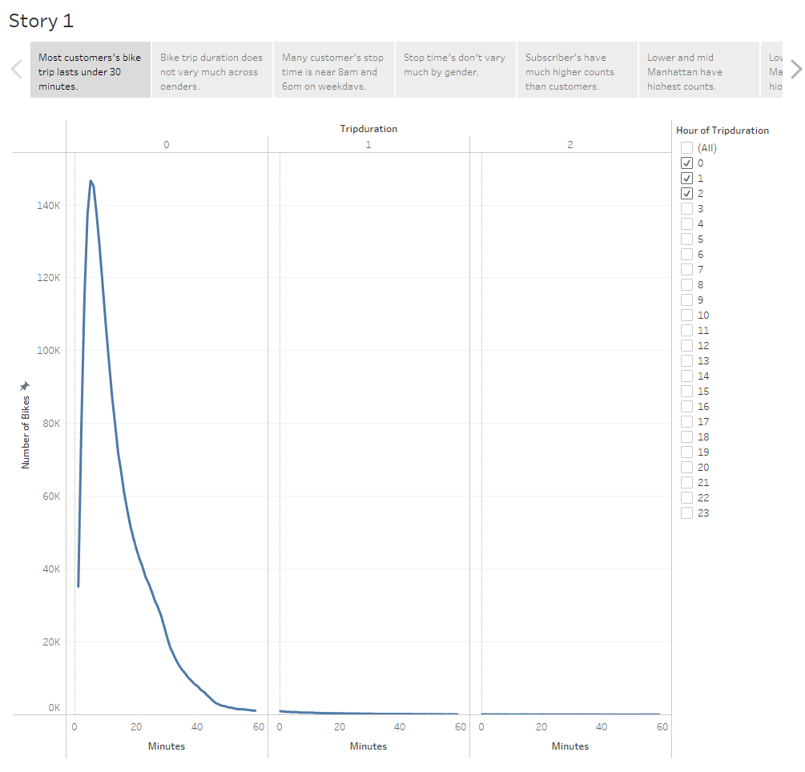
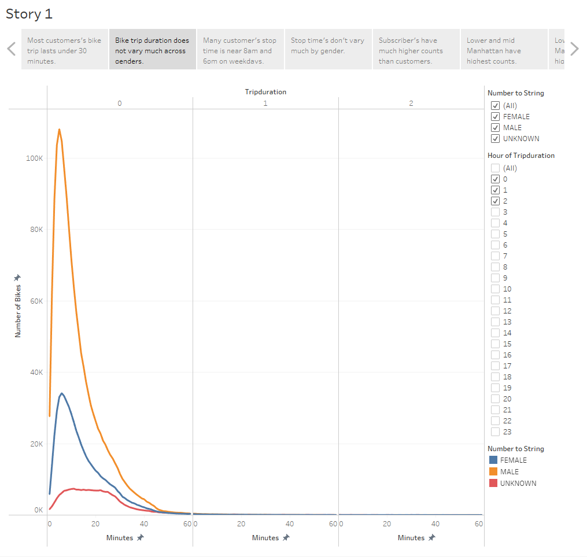
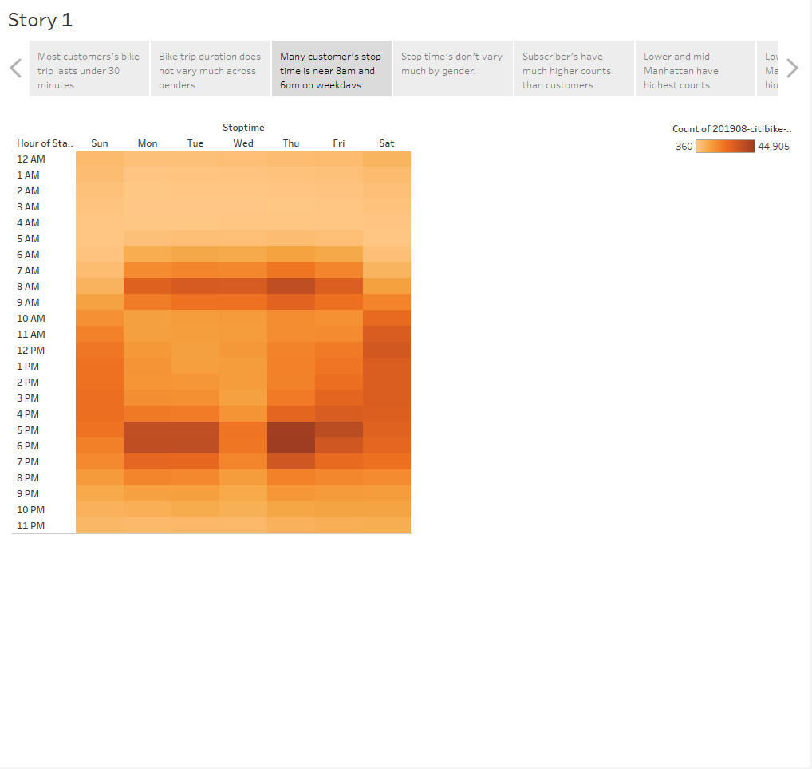
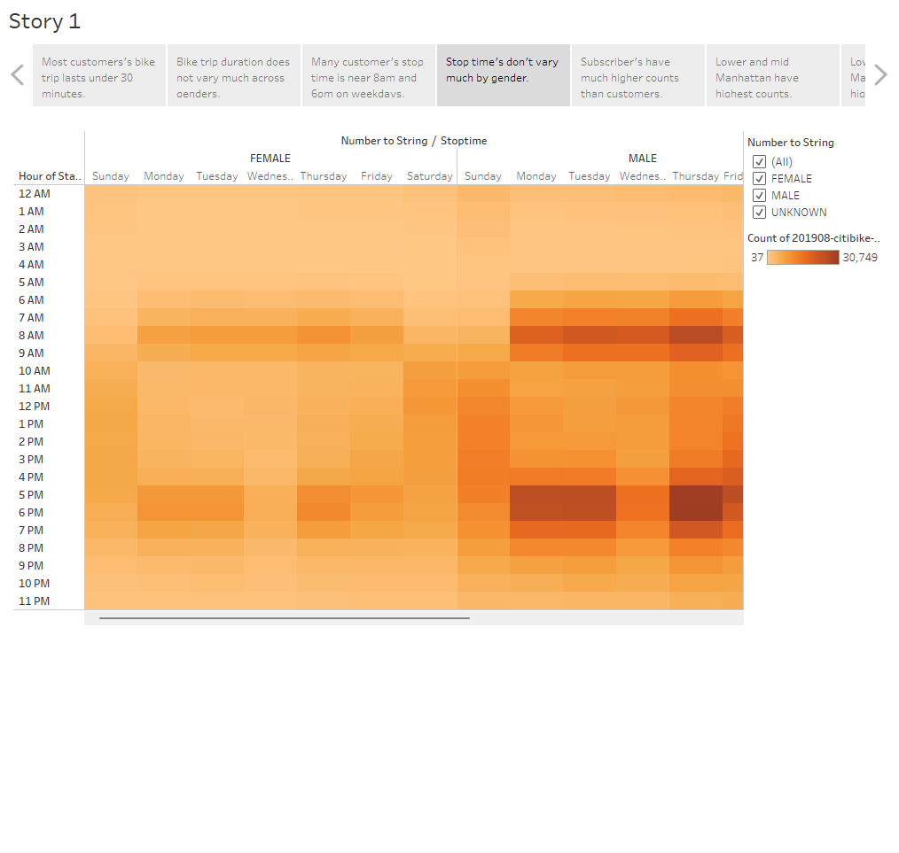
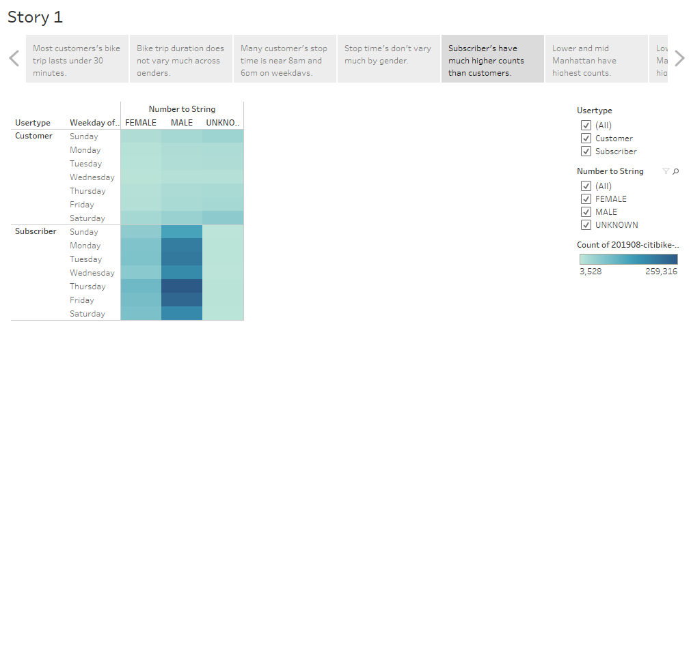
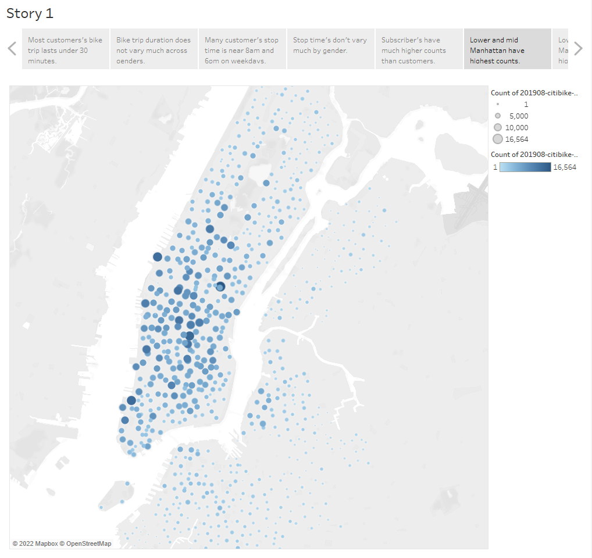
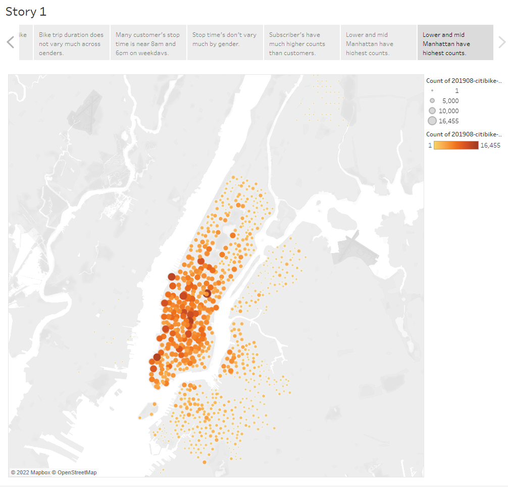

# bikesharing
## Project Overview
The purpose of this project is to analyze bikesharing data in New York City to identify insights for a potential opening of a similar program in a different city. The project requires cleaning some of the data using Python Pandas and visualizing the findings using Tablaeu.

## Project Results
[Link to Dashboard](https://public.tableau.com/app/profile/adrian.martinez3539/viz/NYC_Citibike_Challenge_16629309776840/Story1?publish=yes)

### Checkout Times for Users

### Checkout Times by Gender

### Trips by Weekday per Hour

### Trips by Gender (Weekday per Hour)

### User Trips by Gender by Weekday

### Top Starting Locations

### Top Ending Locations

## Project Summary
The project identified the following key insights:
- Most customer's bike rides last less than 30 minutes and many return their bike rentals around 8am and 6pm on weekdays.
- While males rent more bikes, gender does not appear to be a major factor in determining bike duration or stop times.
- Subscriber's have much higher bike rental counts than regular customers.
- Bike rental counts are much larger in the urban commercial/business district of New York City.

Future analysis/vizualization ideas:
- Analyzing the average length of use a bike gets before needing a repair.
- Analyzing the average distance a bike renter travels. 
